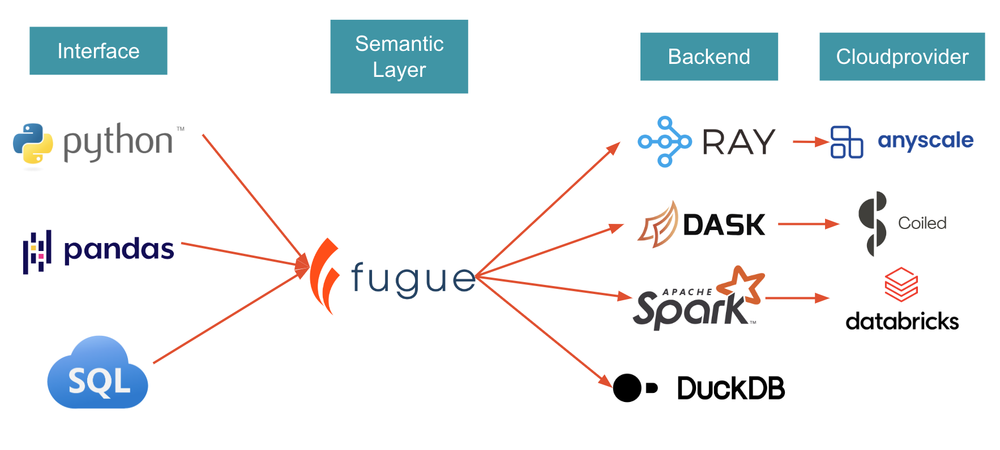

# Welcome to the Fugue Tutorials!

Have questions? Chat with us on Github or Slack:

[](https://github.com/fugue-project/fugue)
[](http://slack.fugue.ai)


[Fugue](https://github.com/fugue-project/fugue) provides an easier interface to using distributed compute effectively and accelerates big data projects. It does this by minimizing the amount of code you need to write, in addition to taking care of tricks and optimizations that lead to more efficient execution on distributed compute. Fugue ports Python, Pandas, and SQL code to Spark, Dask, and Ray.



Quick Links:

* Scaling Pandas code to Spark, Dask, or Ray? Start with [Fugue in 10 minutes](tutorials/quick_look/ten_minutes.ipynb).
* Need a SQL interface on top of Pandas, Spark and Dask? Check [FugueSQL in 10 minutes](tutorials/quick_look/ten_minutes_sql.ipynb).
* For previous conference presentations and blog posts, check the [Content page](tutorials/resources/content.md).

## How Does Fugue Compare to?

### Spark, Dask, Ray

Fugue simiplifies the usage of these backends. It doesn't re-invent the wheel. Fugue will always push down to these underlying engines. The goal of Fugue is to minimize the amount of framework-specific code users need to learn to leverage these engines. Fugue also serves as a bridge between local testing and large-scale execution.

### PySpark Pandas, Modin

Like Fugue, PySpark Pandas and Modin aim to simplify the experience of working with big data frameworks. The difference is Fugue does not aim to be a drop-in replacement for Pandas, because it is a [sub-optimal interface](https://towardsdatascience.com/why-pandas-like-interfaces-are-sub-optimal-for-distributed-computing-322dacbce43) for distributed computing. There are many operations (especially around the index) that don't translate well to a distributed setting. Fugue advocates a separation of tools and to use each tool's strength. Pandas code is supported and encouraged to describe business logic, but Fugue will use Spark, Dask, or Ray to distribute these multiple Pandas jobs.

### dbt

dbt is a programming interface that pushes down the code to backends (Snowflake, Spark). Fugue also has FugueSQL, which is a SQL-like interface for pushing down to backends (DuckDB, Spark, Dask). FugueSQL is also extending to the data warehouse side with integrations like BigQuery and Trino. The main difference between dbt and Fugue is that Fugue does not confine users to SQL. It also supports Python (and encourages a mix of SQL and Python). dbt supports Python, but it's not a first-class citizen and not scalable.

### DuckDB

DuckDB is a backend for Fugue, allowing users to prototype code in a local setting, and then scale out by switching the backend. For more information, see the [DuckDB documentation](https://duckdb.org/docs/guides/python/fugue)

### Ibis

Fugue has an Ibis integration that is more about accessing data in various data stores already. For example, we use it under the hood also for our [BigQuery integration](https://fugue-tutorials.readthedocs.io/tutorials/integrations/warehouses/bigquery.html).

The differences:

1. Fugue guarantees consistency between backends. NULL handling can be different depending on the backend. For example, Pandas joins NULL with NULL while Spark doesn't. So if users prototype locally on Pandas, and then scale to Spark, Fugue guarantee same results. Fugue is 100% unit tested and the backends go through the same test suite.

2. Ibis is Pythonic for SQL backends. We embrace SQL, but understand its limitations. FugueSQL is an enhanced SQL dialect that can invoke Python code. FugueSQL can be the first-class grammar instead of being sandwiched by Python code. Fugue's Python API and SQL API are 1:1 in capability.

3. Fugue doesn't want users to learn any new language. Ibis is a new way to express things; we just want to extend the capabilities of what people already know (SQL, native Python, and Pandas). Fugue can also be incrementally adopted, meaning it can be used for just one portion of your workflow.

4. Roadmap-wise, Fugue thinks the optimal solutions will be a mix of different tools. A clear one is pre-aggregating data with DuckDB, and then using Pandas for further processing. Similarly, can we preprocess in Snowflake and do machine learning in Spark? Fugue is working on connecting these different systems to enable cross-platform workloads.

### Polars

Polars is a local engine similar to Pandas. Fugue has a [Polars Integration](https://fugue-tutorials.readthedocs.io/tutorials/integrations/backends/polars.html) that allows users to run Polars code across a Spark, Dask, or Ray cluster. 

## Installation

In order to setup your own environment, you can pip (or conda) install the package. Fugue can then

```bash
pip install fugue
```

Backend engines are installed separately through pip extras. For example, to install Spark:

```bash
pip install "fugue[spark]"
```

If Spark, Dask, or Ray are already installed on your machine, Fugue will be able to detect it. Spark requires Java to be installed separately.

## Running the Code

The simplest way to run the tutorial interactively is to use [mybinder](https://mybinder.org/v2/gh/fugue-project/tutorials/master). Binder spins up an environment using a container.

>- **Some code snippets run slow on binder** as the machine on binder isn't powerful enough for a distributed framework such as Spark.
>- Parallel executions can become sequential, so some of the performance comparison examples will not give you the correct numbers.

Alternatively, you should get decent performance if running the Docker image on your own machine:

```
docker run -p 8888:8888 fugueproject/tutorials:latest
```

```{toctree}
:maxdepth: 6
:caption: Quick Look
:hidden:

tutorials/quick_look/ten_minutes
tutorials/quick_look/ten_minutes_sql
```

```{toctree}
:maxdepth: 6
:caption: Tutorials
:hidden:

tutorials/beginner/index
tutorials/advanced/index
tutorials/fugue_sql/index
tutorials/extensions/index
```

```{toctree}
:maxdepth: 6
:caption: Integrations
:hidden:

tutorials/integrations/backends/index
tutorials/integrations/cloudproviders/index
tutorials/integrations/warehouses/index
tutorials/integrations/ecosystem/index
```

```{toctree}
:caption: Applications
:hidden:

tutorials/applications/use_cases/index
tutorials/applications/examples/index
tutorials/applications/recipes/index
tutorials/applications/debugging/index
```

```{toctree}
:caption: Fugue Libraries
:hidden:

tutorials/tune/index
```


```{toctree}
:caption: Resources
:hidden:

tutorials/resources/appendix/index
tutorials/resources/best_practices/index
tutorials/resources/content
tutorials/resources/major_changes
```
